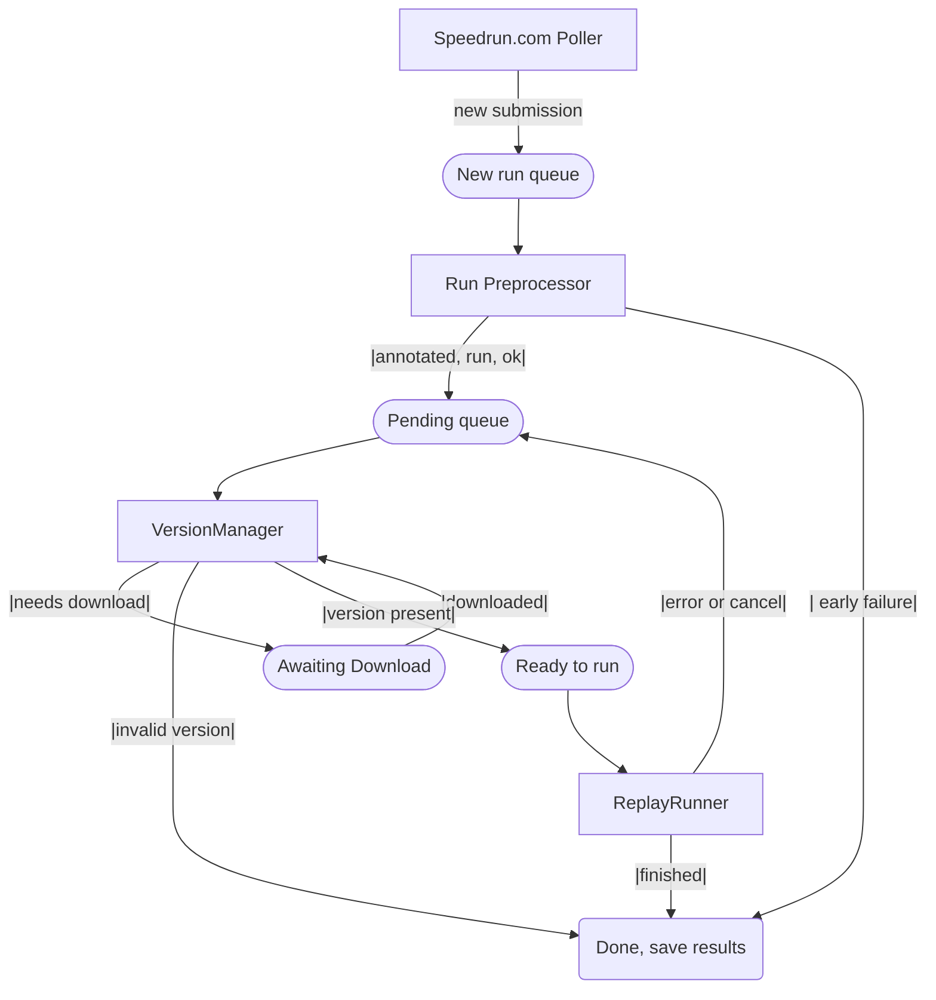

# Factorio Speedrun Validation System - Code Architecture

Generated with the help of LLMs

## Overview
A Rust application that automatically validates Factorio speedrun submissions by running replays and checking rule compliance.

This will poll speedrun.com for new submissions.
For each submission, it extracts a replay file from it and extracts some data from it:
- Static data, such as game version and mods used
- Replay data -- will install a script on the replay file that logs events, and runs the replay

Later, a different component can check the replay data against a ruleset for compliance.

## Code Components
**Main Application**: One Rust binary handling all components
- **Speedrun.com submission Monitor**: Background task polling speedrun.com every 5-15 minutes
- **Persistent Job Queue**: Database-backed queue that survives restarts
- **Factorio Version Manager**: Manages and downloads new Factorio versions for replay execution
- **Replay runner**: Installs replay scripts and runs Factorio replays. Also includes methods for extracting other replay data
- **API Server**: Axum server in the same process

**Supporting components**:
- **Rule Engine**: defines static data, events, and rules, and utilities to validate replay data against ruleset
- **Web API**: web api and schema definitions

## Considerations

- Version downloading should be able to happen concurrently with replay running. (Checking for replay version is a fast process).
- Extracted replay data will be stored as simple json files on disk per replay.
- Every job will have one database entry recording its progress. This allows for monitoring and queue recovery on startup.
- Graceful shutdown

## Job flow

Every time a job moves stages/queues, a corresponding database entry is also updated.

There will be a system to manage the maximum amount of concurrent jobs/db space.
A job here is defined from the moment it enters RunPreprocessor and exits ReplayRunner (or shortcuts to Done due to error).



## Components in detail

Actor model.

### 1. Speedrun.com poller
Polls speedrun.com API for new submissions.
- Every 15 minutes.
- Tracks processed submissions to avoid duplicates
- For new submissions, creates a new db entry, and puts in new run queue.

### 2. Replay Preprocessor
Gathers replays and prepares it for processing.
Broken in to a few parts:
1. Replay finder
- Searches run information for a replay file, and tries to downloads it
- Basic security checks
2. Replay analyzer:
- Reads the replay zip, and extract some initial information
  - If it is a valid replay
  - Game version, mod versions
Produces "annotated replay" (+ another json file with run information.
3. replay sorter
- If version present, skips to "ready to run" queue
- If version not present, notifies the factorio version manager and puts in "awaiting download" queue
- If invalid, saves as error

### 3. Factorio Version Manager
Manages Factorio installations.
- Simple filesystem storage.
- Tracks downloaded versions, and downloads in progress.
- Queue for version downloads.
- API to check for version availability
- Manages versions, deletes versions older than 1 month.

### 4. Replay Runner
Installs script in replay, and collects data.
Steps:
- Extract replay zip file.
- Install replay run script:
  - Runs factorio with --run-replay. Script logs events to log file; runner extracts log messages and saves them to disk.
- Install replay benchmark script (for data collected at end of replay):
  - Runs factorio with --benchmark. Script produces json output, that is copied/moved.

## Other parts

### Common replay data types
Defines replay data, replay events, and other run information.

### Rule Engine.
Checks replay data against defined category rules.
Uses common replay data types.
- Category-based rule sets
- Rule storage: YAML configuration files. Possibly multiple revisions of rules for each category.
- Rule check: given replay data and ruleset, generates a report on rule compliance.

### 5. API
REST API for external interactions
Endpoints:
  - `GET /submissions/{id}/status` - Check processing status
  - `GET /submissions/{id}/report` - Get validation report
  - `POST /admin/retry/{id}` - Manual retry controls
  - TODO: others

## State Persistence & Recovery

### Job State Management
- All jobs stored in database with status tracking, depending on what stage they are in
- Current job status persisted during processing
- Queues reconstructed from database on startup


## File Storage Structure
```
├── replays/
│   └── {id}/
│       ├── save.zip
│       ├── metadata.json // metadata, cached speedrun.com details
│       ├── save-data.json // game versions, mod versions, appropriate startup settings
│       ├── replay-events.json // events generated by replay script
│       └── replay-stats.json // data generated by post-replay (benchmark) script
└── factorio/
    └── {versions}
```
